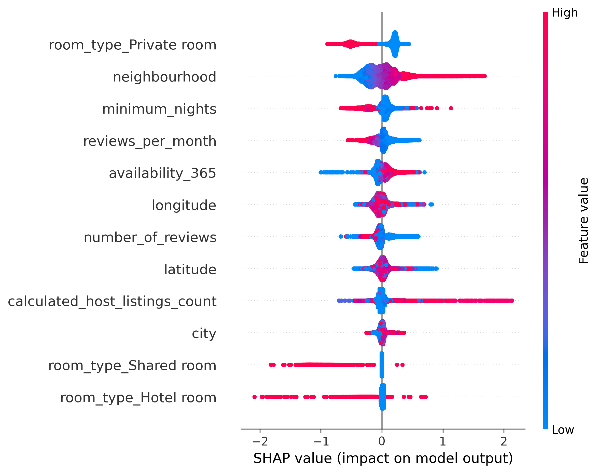
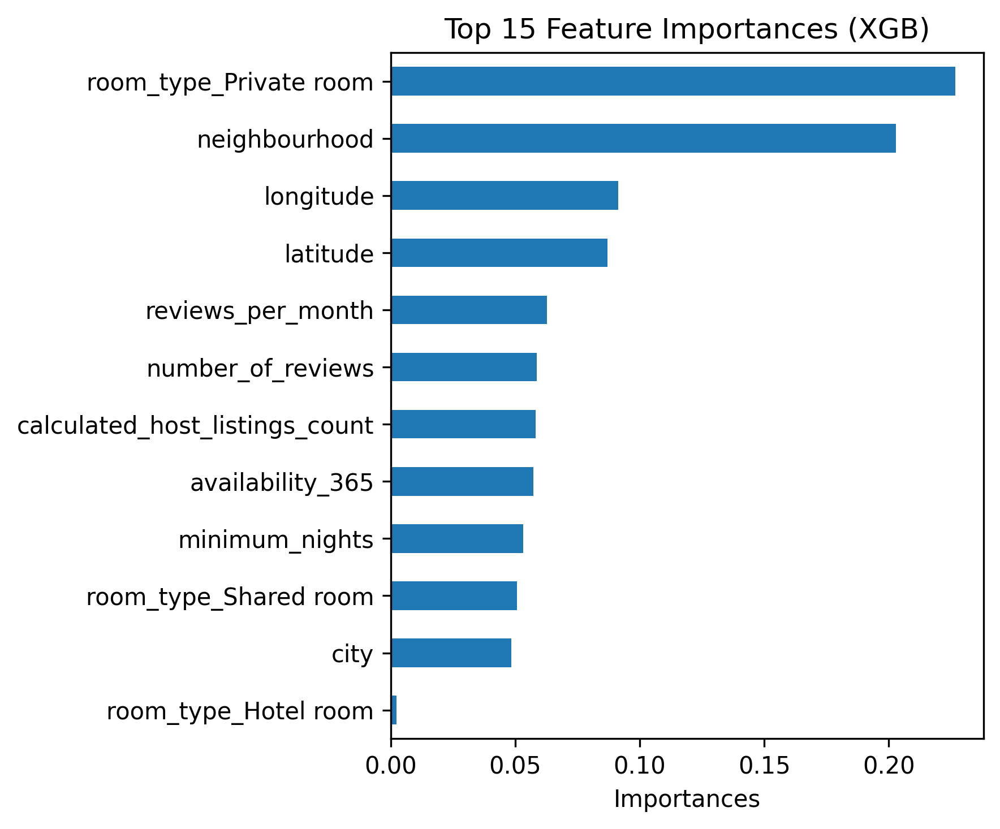
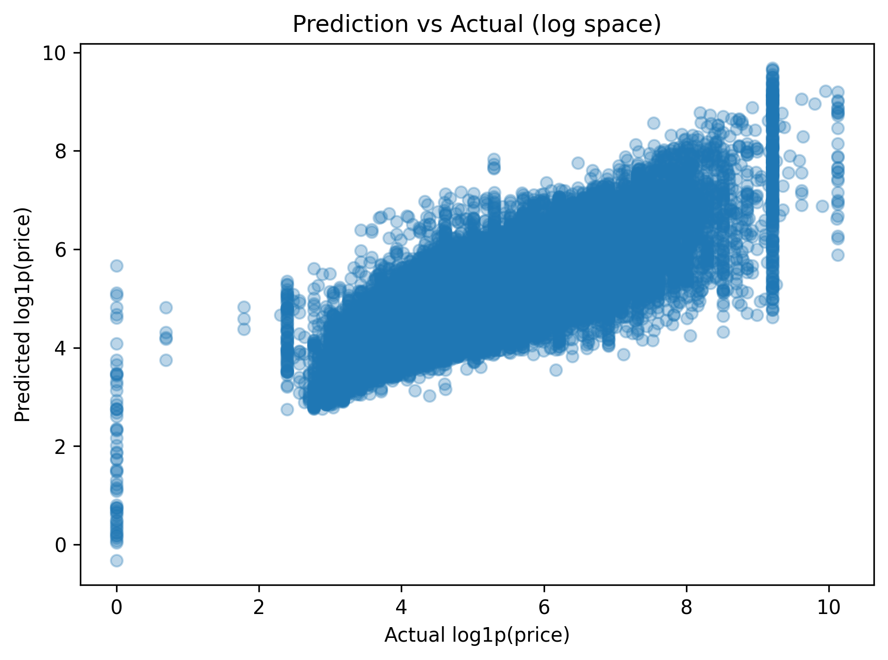

# Airbnb Price Prediction with Machine Learning

This project builds and evaluates machine learning models to predict Airbnb listing prices using structured listing data.  
The goal is not only to achieve reasonable predictive performance, but also to **interpret model behavior and analyze prediction errors**.

---

## Project Overview

- **Task**: Regression – predict Airbnb listing price  
- **Target variable**: `log1p(price)`  
- **Motivation**: Airbnb prices vary significantly across locations and room types.  
  This project explores how well machine learning models can capture pricing patterns and what factors drive predictions.

---

## Dataset

- Public Airbnb listings dataset (city and neighbourhood-level features)
- Key features include:
  - Room type
  - City & neighbourhood
  - Availability and minimum nights
  - Reviews and host activity
  - Geographic coordinates (latitude & longitude)

> Note: The dataset is not included in this repository.  
> Please download it separately and place it in a `data/` directory if you want to reproduce the results.

---

## Methods

### Feature Engineering
- One-hot encoding for room type
- Target encoding for high-cardinality categorical features (`city`, `neighbourhood`)
- Log transformation of price (`log1p(price)`)
- Basic outlier handling and missing value removal

### Models
- Linear Regression (baseline)
- Random Forest Regressor
- **XGBoost Regressor** (final model)

### Model Evaluation
- Train/test split for initial comparison
- **5-fold cross-validation using Pipeline** to prevent data leakage
- Metrics: R²
- Final model interpretation using **SHAP**

---

## Results

### Model Performance
- XGBoost achieved the best performance among tested models
- Cross-validation results show **high variance across folds**, indicating strong heterogeneity in pricing patterns across locations

### Key Insights (from SHAP)
- **Room type and neighbourhood are the most influential features**
- Private and shared rooms consistently reduce predicted prices
- Location-related features show large variability, explaining cross-validation instability
- High-priced listings are harder to predict accurately

### Error Analysis
- Prediction vs. Actual plots show:
  - Strong overall correlation
  - Increasing prediction variance for higher-priced listings
  - Systematic underestimation of very expensive listings

---

## Visualizations

The following plots are included in the `images/` directory:






---

## How to Run

1. Clone the repository
2. Install dependencies:
   ```bash
   pip install -r requirements.txt

---

## Author

© 2025 Mutian He  
This project was developed by Mutian He for learning purposes.
